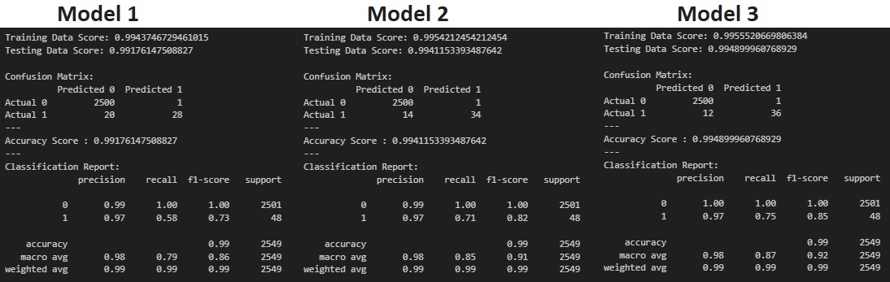

# Make America Safe... Again?

## Prerequisites
### API keys
To complete the ETL steps, the following APIs are used that need keys:
- Create a module named `config.py` in `/ETL`
- Add a variable called `api_census_key` and containing your US census API key in `config.py`
No prerequisites are needed to run the dashboard itself.

## How to build the project from scratch (optional)
The project contained in this repository is ready to run once the prerequesites are met.

However, if you would like to start with a blank sheet, the following steps can be followed

### Preparation
- Delete all CSV files in `/clean_data`
- Delete `blackbox_db.sqlite` and `openbox_db.sqlite` in `/Server`
- Delete `blackbox.model` in `/Server`

### Download the Violence Project Shooter Database
The Violence Project Shooter Database can be accessed under non-commercial license and may not be distributed without the authors' consent. It is therefore not included in this repository.

To run the project from sratch, the database must be added using the following steps:

- Obtain the Database Version 7 (Updated June 2023) in XLSX format from https://www.theviolenceproject.org/ 
- Convert the tab `Full Database` in the XLSX to a CSV file called `full_database.csv`
- Add `full_database.csv` to `/raw_data`

### ETL process (all notebooks are in `/ETL`)
1. Run `ETL_shooters_data_to_csv.ipynb`, make sure that `clean_shooters.csv` is created in `/Datasets/clean_data`
2. Run `ETL_autism_data_to_csv.ipynb`, make sure that `clean_autism.csv` is created in `/Datasets/clean_data`
3. Run `ETL_census_data_to_csv.ipynb`, make sure that `clean_male_population_age.csv` is created in `/Datasets/clean_data` and `population_stats.csv` in `/ETL`
4. Run `ETL_risks_to_openbox_db.ipynb`, make sure that `openbox_db.sqlite` is created in `/Server`
5. Run `ETL_shooters_data_to_db.ipynb`, make sure that `openbox_db.sqlite` is created in `/Server` and `model_blackbox_shooters.csv` in `/Model`
6. Run `Create_general_population_data.ipynb`, make sure that `model_blackbox_genpop.csv` is created in `/Model` (optionally, you can also create other CSV files in `/Examples`)

### Model training (all notebooks are in `/Model`)
1. Follow the ETL process (above) first and make sure all the necessary files are created as expected
2. Run `Model_training.ipynb`, make sure that `blackbox.model` and `blackbox.scaler` are created in `/Model`

## How to run the Web App

### Launch the Web App
Open `index.html` (in `/docs`) in any browser (Google Chrome is recommended.)

Note that the current version of the Web App only runs locally and is not hosted on the web.

### Start the Flask Server
1. Navigate to `/Model`
2. Start Flask by using the command `python flask_app.py`
3. Check your console to make sure Flask is running
4. Navigate to the address indicated in the console

### Add, analyse and delete data
Please refer to the FAQ in the Web App: `/docs/faq.html`

## File structure
### Directories
- `clean_data` contains all the CSV files extracted or created as part of the ETL process
- `docs` contains the HTML, JavaScript and CSS used to create the Web App
- `ETL` contains files to extract data from API or through web scraping and downloaded CSV files, transform the data, and load them into databases or clean CSV files
- `Examples` contains CSV files that can be used in the Web App for demonstration or test purposes
- `Model` contains the files used to design, train and test the Machine Learning models
- `Server` contains the Flask code, the saved (pickled) models, the Python modules used in the Flask app, and the SQLite databases

Please refer to the dataflow in the next section for more information about the features of the different files and how they are used to manipulate the data.

## Dataflow

## Analysis
### Research questions and approach
We want to answer two main questions:
- What do the shooters have in common?
- Can we identify risky individuals early?

To answer these questions, we take the following approach:
- Consider the known information about the shooters, based on the information in the <a href="https://www.theviolenceproject.org">Violence Project</a> database
- Identify conditions, such as unemployment or mental illness, that are above average compared to the general population
- Use a Bayesian approach to estimate the increased risk for an individual presenting a set of conditions
- In a second time, develop a classification method to predict whether an individual can potentially become a shooter
- Build a tool allowing the evaluation of data about amy individuals

### Bayesian approach (OpenBox)
We compare the probability of an indivudal having a certain condition $c$, knowing that they committed a mass shooting ($k$), to the probability of any individual in the general population having a condition. The conditions we look at are:
1. Mental illness
2. Unemployment
3. Prior arrests
4. Autism spectrum

The risk factor is calculated as follow:

$$ R_i = \frac{P(c_i|k)}{P(c_i)}$$

with $R_i$ the risk factor for condition $c_i$. We assume the four conditions to be completely independent, the total risk factor is therefore:

$$R = R_1 * R_2 * R_3 * R_4$$

We find that risk factors can go as high as 3000+ when an individual presents all conditions. This means that such an indiviudal may be 3000 times more likely than anyone in the population to commit a mass shooting.

The model is called OpenBox due to the straightforward relationship between the features and the risk factor (simple equation.) The model presents two limitations:
1. The risk factor is difficult to interpret compared to a binary classification
2. The conditions are assumed to be independent which may not be the case in real life

### Machine Learning approach (BlackBox)
To compensate for the limitation of the OpenBox model, we develop a Machine Learning classifier that looks at more conditions.

We try 3 different models:
- Model 1: Logistics regression without scaling
- Model 2: Logistics regression with scaling
- Model 3: SVM with scaling

All three models are trained using labelled data:
- the <a href="https://www.theviolenceproject.org">Violence Project</a> database, containing 193 shooters is used for Class 1 (shooters)
- Class 0 (non-shooters) is generated based on probabiity distribution extracted from various data sources such as the US census, FBI data on arrest rates per state, health data about mental illness and autism in the US.

The performance of the three models is shown below:

While SVM provides the best results, logistic regression is used as it allows to provide direct probabiliy for each prediction.

### Conclusions
**What do the shooters have in common?**
- Higher than average probability conditions such as unemployment, mental illness, rate of arrest and autistic traits
- These can be used to tentatively identify potentially risky individuals

**Can we identify risky individuals early?**
- The Bayesian approach allows to identify strong risk drivers and is a good first order approach but it is oversimplistic
- The model based on logistic regression provides a more direct way of classifying the individuals and providing the corresponding probability
- The performance of the models is acceptable but could be improved with additional data or different models and tuning that have not be tried in the scope of this project

### Limitations and future work
- Consolidate data for a single year or period. The current models are built with data from different years between 2018 and 2021. Data are assumed to be constant or at least comparable and interchangeable from one year to another and data from different years are used to complete the datasets when required. For instance, arrests data for 2018 from the FBI where used but the data for Iowa were incomplete and were simply replaced by 2019 data for that state. No verification has been performed to make sure that such a swap in data was valid and justified.
- Add more conditions to compare with the general population, such as: alcohol and drug use, head injuries, prejudices, firearms preficiency and interest, etc.
- Add data from more gun-related crimes. The current models only consider mass shootings. While this is the most dramatic type of gun violence, they are still rare events compared to gang-related violence, domestic violence and other crimes where firearms are involved. Adding more data could allow to refine the shooter profiles and increase the accuracy of the models.

### Data Sources
- **Shooter information**: Peterson, J., & Densley, J. (2023). The Violence Project database of mass shootings in the United States (Version 7). https://www.theviolenceproject.org
- **Mental Illness Information**: States with the highest levels of mental health illness - NiceRx. https://worldpopulationreview.com/state-rankings/mental-health-statistics-by-state
- **Unemployment Data**: Unemployment Rates for States - U.S. Bureau of Labor Statistics (2023). https://worldpopulationreview.com/state-rankings/unemployment-rate-by-state
- **Arrests by State**: Federal Bureau of Investigation (2018). https://ucr.fbi.gov/crime-in-the-u.s/2018/crime-in-the-u.s.-2018/topic-pages/tables/table-69 (Data for Iowa based on 2019 figures due to lack of information in 2018)
- **Autism prevalence**: National Library of Medicine, J Autism Dev Disord. 2020 Dec; 50(12): 4258–4266. https://www.ncbi.nlm.nih.gov/pmc/articles/PMC9128411/table/T2/
- **Other census datan**: U.S. Census Bureau (2018-2021). Accessed through `census` Python module API
